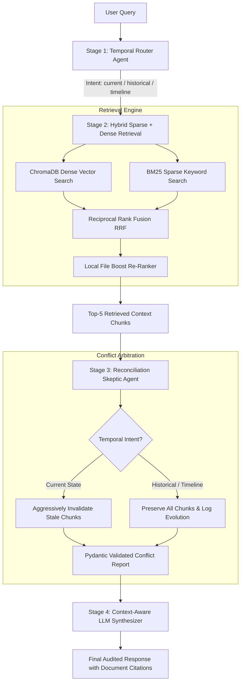
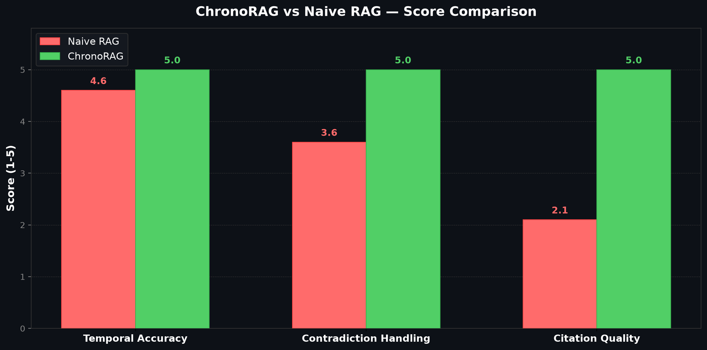
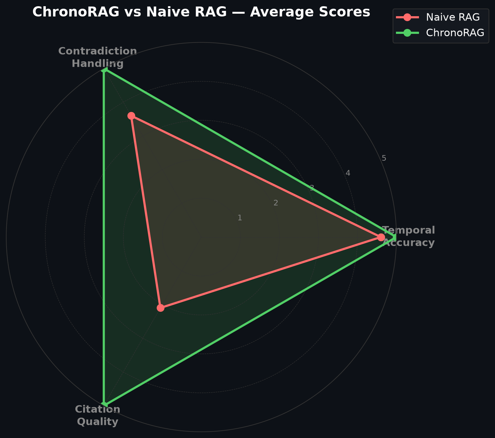
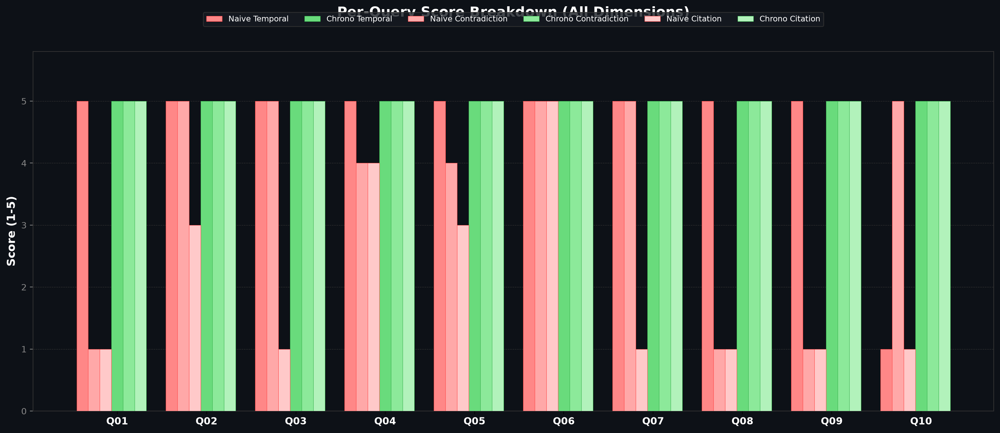

# ChronoRAG: Multi-Agent Temporal Reconciliation & Cross-Modal Conflict Arbitration Engine

[](https://python.org)
[](https://fastapi.tiangolo.com)
[](https://groq.com)
[](https://trychroma.com)
[](https://opensource.org/licenses/MIT)

> **ChronoRAG** is an open-source, multi-agent Retrieval-Augmented Generation (RAG) system engineered to solve temporal context inversion, cross-modal factual drift (unstructured text vs. structured Markdown tables), and passive document acceptance in evolving corporate knowledge bases.

### 👥 Authors & Lead Engineers
- **Vishwas H N** — [@vishwashn12](https://github.com/vishwashn12)
- **Shreyas G R** — [@shreyasgr9087-cloud](https://github.com/shreyasgr9087-cloud)

---

## 📋 Table of Contents
- [1. Executive Summary & Problem Statement](#1-executive-summary--problem-statement)
- [2. Failure Modes of Standard RAG](#2-failure-modes-of-standard-rag)
- [3. System Architecture](#3-system-architecture)
- [4. Research Alignment & Technical Novelty (2025–2026)](#4-research-alignment--technical-novelty-20252026)
- [5. Related Work & Literature Survey](#5-related-work--literature-survey)
- [6. Automated Evaluation & Benchmark Scorecard](#6-automated-evaluation--benchmark-scorecard)
- [7. Project Directory Structure](#7-project-directory-structure)
- [8. Quickstart Guide](#8-quickstart-guide)
- [9. Authors](#9-authors)

---

## 1. Executive Summary & Problem Statement

Retrieval-Augmented Generation (RAG) pipelines have become the industry standard for grounding Large Language Models (LLMs) in enterprise knowledge bases. However, **standard vector search operates purely on semantic similarity**, completely ignoring temporal metadata, effective policy dates, document versioning, and structural consistency.

In dynamic corporate environments—where travel allowances, remote work guidelines, salary bands, and data retention policies undergo periodic revisions—semantic-only retrieval causes critical system failures. A query such as *"What is the current daily meal allowance?"* yields high similarity scores for both a 2022 policy ($50/day) and a 2026 policy ($100/day). Standard RAG pipelines retrieve both context chunks and pass them to an uncritical LLM, resulting in hallucinated, contradictory, or outright incorrect responses.

**ChronoRAG** resolves these challenges by introducing a **Multi-Agent Temporal Reconciliation and Arbitration Architecture** powered by open-source models (`Llama-3.3-70B-versatile` via Groq) and deterministic date-aware filtering.

---

## 2. Failure Modes of Standard RAG

Standard RAG architectures exhibit three major vulnerabilities when deployed over temporal, multi-version knowledge bases:

```
┌────────────────────────────────────────────────────────────────────────────────────────┐
│                                 CRITICAL RAG FAILURE MODES                             │
├───────────────────────────────┬───────────────────────────────┬────────────────────────┤
│  1. Temporal Context          │  2. Cross-Modal Contradiction │  3. Uncritical Passive │
│     Inversion & Fact Blending │     Blindness                 │     Acceptance         │
├───────────────────────────────┼───────────────────────────────┼────────────────────────┤
│ Outdated policies (e.g. 2022) │ Updates often occur across    │ Pipelines implicitly   │
│ and active policies (e.g.     │ modalities (e.g. an old text  │ trust vector database  │
│ 2026) are retrieved together. │ paragraph vs a newly updated  │ output without audit,  │
│ Single-pass LLMs blend        │ Markdown table). Standard     │ failing to invalidate  │
│ contradictory facts into a    │ pipelines lack cross-modal    │ superseded context     │
│ single non-compliant answer.  │ arbitration logic.            │ prior to generation.   │
└───────────────────────────────┴───────────────────────────────┴────────────────────────┘
```

---

## 3. System Architecture

ChronoRAG implements a modular 4-stage pipeline that converts raw user queries into audited, time-aware responses:



### Pipeline Components

1. **Temporal Intent Classification (`run_temporal_router`)**:
   Classifies incoming user queries into one of three temporal orientations using structured JSON generation:
   - `current`: Queries seeking the latest active policy (triggers aggressive stale document invalidation).
   - `historical`: Queries targeting a specific past time frame (preserves historical documents without invalidation).
   - `timeline`: Queries tracking policy evolution over time (presents chronological before-and-after breakdown).

2. **Hybrid Sparse + Dense Retrieval & RRF (`pipeline.py`)**:
   Combines ChromaDB vector embeddings (`all-MiniLM-L6-v2`) with sparse BM25 keyword matching using Reciprocal Rank Fusion ($k=60$). A specialized domain booster ranks primary organization documents above synthetic benchmark background noise.

3. **Reconciliation Skeptic Agent (`run_reconciliation_skeptic`)**:
   An auditing agent operating with structured `instructor` and Pydantic schemas. It compares retrieved document pairs (including text-vs-table formats), constructs explicit `invalidated_doc_id` $\rightarrow$ `valid_doc_id` dependency trees, and purges superseded evidence before final synthesis.

4. **Context-Aware LLM Synthesizer (`run_synthesizer`)**:
   Generates authoritative, fully cited answers grounded exclusively in surviving context documents and explicit temporal audit logs.

---

## 4. Research Alignment & Technical Novelty (2025–2026)

Recent AI literature (2025–2026) emphasizes that temporal reasoning and contradiction resolution are critical bottlenecks for production RAG systems. ChronoRAG implements two key engineering innovations:

### 1. Tabular Markdown Conversion over Unreliable VLM Vision
Recent benchmarks like **CMC-Bench (2026)** demonstrate that Vision-Language Models (VLMs) suffer significant accuracy drops when visual charts contradict textual paragraphs. ChronoRAG converts tabular data into structured Markdown/JSON during document ingestion ([ingest.py](file:///c:/Users/User/Documents/CURRENT%20PROJECTS/ChronoRAG/backend/ingest.py)), enabling fast text-only models (`Llama-3.3-70B`) to execute cross-modal conflict resolution at a fraction of VLM latency and cost.

### 2. Multi-Persona Prompting for Conflict Arbitration
While academic systems like ConflictRAG rely on separately trained MLP classifier heads to detect factual contradictions, ChronoRAG achieves deterministic conflict arbitration through a sequential **Multi-Persona Prompting Framework** on a single open-source model backbone, eliminating specialized model overhead.

---

## 5. Related Work & Literature Survey

ChronoRAG directly addresses research gaps identified in recent literature:

1. **Temporal-Sensitive Retrieval:**
   - **ChronoQA** ([arXiv:2508.12282](https://arxiv.org/abs/2508.12282)): Introduces evaluation benchmarks for time-sensitive QA. ChronoRAG directly solves the multi-document temporal reasoning failures highlighted in ChronoQA.
   - **TempLAMA** ([arXiv:2106.15110](https://arxiv.org/abs/2106.15110)): Demonstrates temporal knowledge degradation in LLMs. ChronoRAG uses TempLAMA benchmark records during ingestion testing.

2. **Knowledge Conflict & Contradiction Resolution:**
   - **ConflictRAG** ([arXiv:2605.17301](https://arxiv.org/abs/2605.17301), May 2026): Proposes inter-document conflict resolution before generation. ChronoRAG implements this concept using multi-persona agentic auditing.
   - **Entity-Based Knowledge Conflicts** ([arXiv:2109.05052](https://arxiv.org/abs/2109.05052)): Explores parametric vs. non-parametric memory conflicts.

3. **Deterministic Fact Arbitration:**
   - **Don't Ask the LLM to Track Freshness** ([arXiv:2606.01435](https://arxiv.org/abs/2606.01435), June 2026): Proposes deterministic rule integration over raw generation for conflict resolution, validating ChronoRAG's Pydantic schema enforcement.
   - **Temporal-Causal Consistency** ([ACL 2026](https://aclanthology.org)): Focuses on event ordering and policy supersedence.

---

## 6. Automated Evaluation & Benchmark Scorecard

ChronoRAG includes an automated, standalone evaluation framework ([evaluate.py](file:///c:/Users/User/Documents/CURRENT%20PROJECTS/ChronoRAG/evaluation/evaluate.py)) that compares **ChronoRAG** against a **Naive RAG baseline** across 10 temporal queries using an LLM-as-a-Judge approach scored on three 1–5 scale metrics:

1. **Temporal Accuracy**: Does the response reflect the correct effective date/timeframe?
2. **Contradiction Handling**: Does the response explicitly identify and resolve superseded documents?
3. **Citation Quality**: Are document IDs, dates, and sources cited accurately?

### Aggregate Scorecard Summary

| Metric Dimension | Naive RAG Baseline | ChronoRAG Engine | Absolute Delta | Percentage Improvement |
| :--- | :---: | :---: | :---: | :---: |
| **Temporal Accuracy** | 4.60 / 5.0 | **5.00 / 5.0** | +0.40 | +8.7% |
| **Contradiction Handling** | 3.60 / 5.0 | **5.00 / 5.0** | +1.40 | +38.9% |
| **Citation Quality** | 2.10 / 5.0 | **5.00 / 5.0** | +2.90 | +138.1% |
| **Total Cumulative Score** | **10.30 / 15.0** | **15.00 / 15.0** | **+4.70** | **+45.6%** |
| **Head-to-Head Record** | 0 Wins | **9 Wins (1 Tie)** | — | **90% Win Rate** |

### Benchmark Visualization







### Per-Query Benchmark Breakdown

| Query ID | Category | Query Summary | Naive Total (15) | ChronoRAG Total (15) | Winner |
| :---: | :--- | :--- | :---: | :---: | :---: |
| **Q01** | Current State | Daily meal allowance ($100 2026 vs $50 2022) | 7 / 15 | **15 / 15** | **ChronoRAG** |
| **Q02** | Historical | Remote work policy in 2022 | 13 / 15 | **15 / 15** | **ChronoRAG** |
| **Q03** | Timeline | Engineering salary band evolution | 11 / 15 | **15 / 15** | **ChronoRAG** |
| **Q04** | Current State | Cloud storage permission for PII | 13 / 15 | **15 / 15** | **ChronoRAG** |
| **Q05** | Current State | Hiring freeze active status | 12 / 15 | **15 / 15** | **ChronoRAG** |
| **Q06** | Current State | Senior engineer base salary range | 15 / 15 | 15 / 15 | **TIE** |
| **Q07** | Timeline | PII retention policy evolution | 11 / 15 | **15 / 15** | **ChronoRAG** |
| **Q08** | Historical | Lodging reimbursement limit in 2022 | 7 / 15 | **15 / 15** | **ChronoRAG** |
| **Q09** | Current State | Senior engineer equipment stipend | 7 / 15 | **15 / 15** | **ChronoRAG** |
| **Q10** | Current State | Consecutive low performance ratings | 7 / 15 | **15 / 15** | **ChronoRAG** |

---

## 7. Project Directory Structure

```
ChronoRAG/
├── frontend/                     # React Single Page Application (Vite + Tailwind CSS)
│   ├── src/                      # UI Components & App State
│   ├── public/                   # Static Web Assets
│   ├── package.json              # Frontend Node Dependencies
│   └── vite.config.js            # Vite Development Server Config
│
├── backend/                      # Python Core Engine & FastAPI Server
│   ├── agents.py                 # Router, Skeptic, and Synthesizer Agent Definitions
│   ├── pipeline.py               # BM25 + ChromaDB Hybrid Retrieval & Fusion
│   ├── ingest.py                 # Frontmatter-Aware Ingestion & Table Chunking
│   ├── server.py                 # FastAPI Application Server
│   ├── rag_docs/                 # Local Corporate Markdown Documents
│   └── chromadb_store/           # ChromaDB Vector Store Database
│
├── evaluation/                   # Standalone Evaluation & Benchmarking Suite
│   ├── evaluate.py               # LLM-as-a-Judge Evaluation Script
│   ├── bug_analysis.md           # Audit Diagnostic Log & Quality Assurance Report
│   └── eval_results/             # Generated Scorecards, Plots, and JSON Trajectories
│       ├── bar_comparison.png
│       ├── radar_comparison.png
│       ├── per_query_breakdown.png
│       ├── scorecard.csv
│       └── summary.txt
│
├── .env                          # Environment Configuration (Groq API Keys)
├── .gitignore                    # Version Control Exclusions
└── requirements.txt              # Backend Python Dependencies
```

---

## 8. Quickstart Guide

### Prerequisites
- Python 3.10+
- Node.js 18+ & npm
- Groq API Key ([Get a free key at console.groq.com](https://console.groq.com))

### 1. Environment Setup
Clone the repository and set up a Python virtual environment:

```bash
git clone https://github.com/your-username/ChronoRAG.git
cd ChronoRAG

# Create and activate virtual environment
python -m venv venv
# On Windows:
.\venv\Scripts\activate
# On Linux/macOS:
source venv/bin/activate

# Install backend dependencies
pip install -r requirements.txt
```

Create a `.env` file in the root directory:
```env
GROQ_API_KEY=your_groq_api_key_here
```

### 2. Ingest Knowledge Base Documents
Sync local Markdown policies in `backend/rag_docs/` and load benchmark datasets into ChromaDB:

```bash
python backend/ingest.py
```

### 3. Run API Server & Frontend UI

**Option A: Running API Server (Backend)**
```bash
uvicorn backend.server:app --reload --port 8000
```
*API endpoints will be available at `http://localhost:8000/api/query`.*

**Option B: Running React UI (Frontend)**
```bash
cd frontend
npm install
npm run dev
```
*Access the interactive web application at `http://localhost:5173`.*

### 4. Run Automated Evaluation Suite
Execute the head-to-head comparison benchmark against Naive RAG:

```bash
python evaluation/evaluate.py
```
---

## 9. Authors

- **Vishwas H N** — [@vishwashn12](https://github.com/vishwashn12)
- **Shreyas G R** — [@shreyasgr9087-cloud](https://github.com/shreyasgr9087-cloud)

---

## 📜 License

This project is licensed under the MIT License — see the [LICENSE](LICENSE) file for details.
